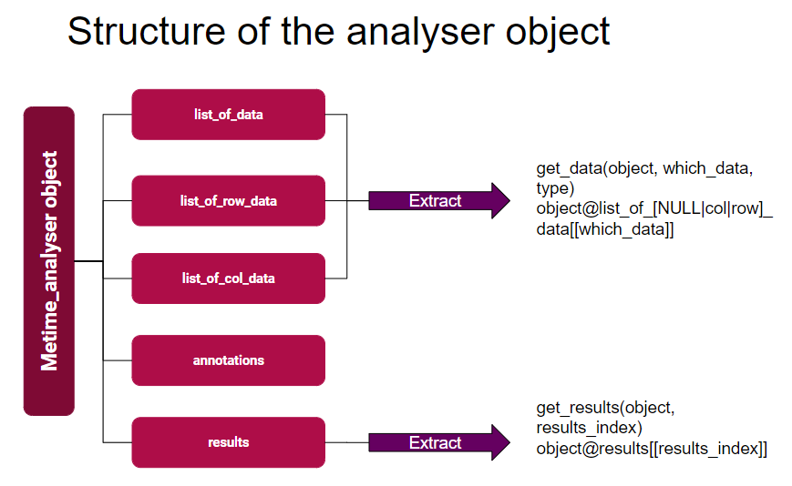
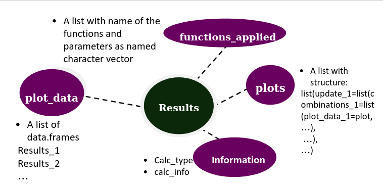
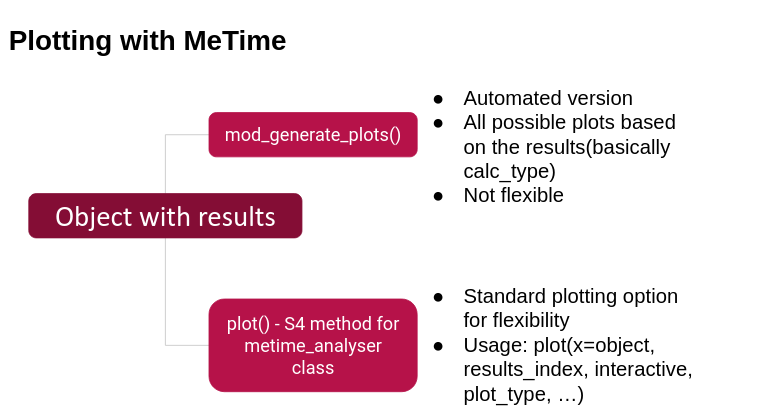

```{r, include = FALSE}
knitr::opts_chunk$set(
  collapse = TRUE,
  comment = "#>"
)
```
```{r setup}
library(MeTime)
```

# An Introduction to MeTime package

The goal of MeTime is to unburden scientists from developing code to perform statistical analysis on longitudinal metabolomics data. This package enables users to perform different kinds of analysis ranging from dimensionality reduction to complex regressions by building pipelines. Users can browse different vignettes to see the different kinds of analysis that MeTime provides along with example data and analysis. 

This document, however, provides an overview of the MeTime R package. It is divided into three main sections:
1. metime_analyser class, data preparation and types of analyses
2. Functions, building pipelines and plotting the results
3. For Developers

## 1. metime_analyser class and data preparation

### 1.1. metime_analyser class

This package builds upon the S4 class of metime_analyser which serves as a central repository that stores the data, results and the information of functions applied onto this object in a pipeline. The reasons to create such an object is as follows:
- There are often multiple datasets that a user wants to analyse and there is no class in R that can store all the data at once. The closest relative of metime_analyser is summarizedExperiment(SE), which however stores information of only a single dataset.
- As the metime_analyser object will contatin multiple datasets at once. It is easier to parse this into other functions and modify/analyse all the datasets at once thereby removing the need of duplicating the same analysis for different datasets.
- Moreover, users can now perform analyses which clubs two or more datasets at once.
- To be able to reproduce the results and maintain transparency, information regarding the functions applied onto a metime_analyser object are also stored. See the structure of results below to understand this better. 

The metime_analyser class has 5 slots:
1. list_of_data: Consists of a list of data matrices of metabolite concentrations
2. list_of_row_data: Consists of a list of row-data information(samples) for the respective data matrices
3. list_of_col_data: Consists of a list of col-data information(metabolites) for the respective data matrices
4. annotations: This is a list to define how the phenotype data and medication data are named. Can also include other datasets, however, only phenotype and medication data are important as they are different from the other datasets which are actually analysed.

```{r example}
annotations=list(phenotype="name_of_the_dataset/file", 
                      medication="name_of_the_dataset/file")
```

5. results: List where the results of the analyses are stored. This list contains upto 4 elements namely: functions_applied, plot_data, plots and information. functions_applied is a named list with names being the functions that were applied onto the object until a particular calculation(analysis) is performed. plot_data is a list of dataframes which are the results of an analysis. plots is a list that stores plots. information is inturn a list with two elements calc_type and calc_info. calc_type is a character vector that defines the type of analysis and calc_info is a more detailed desciption of the calculation performed.  

```{r structures}
# structure of analyser object


# structure of results


```

### 1.2. Data preparation

This package aims to be a general package that can handle any type of longitudinal dataset and in order to acheive that we expect the users to make a few changes to the dataset. These changes are:
1. The sample ids should always be in this format: [a-z|A-z][0-9]+_[a-z|A-Z][0-9]+. The part before the underscore represents the subject and the part after represents the timepoint of measurement. If the timepoints in the data are not a singular value then we suggest the user to create a psuedotime scale to match this format.
2. Every row_data dataframe should contain the columns id, subject and time and every col_data dataframe should contain the column id. And the ids in row_data should match the rownames of the data matrix and the ids in col_data should match the colnames of the data matrix. 

As mentioned earlier the first step in using this package is to create an S4 object of class metime_analyser with all the data that a user wants to analyse. There are multiple ways in which this S4 object can be created:

#### 1.2.1. Loading all the data at once from a folder with all files

```{r example}

path <- "/path/to/directory"
object <- get_files_and_names(path, annotations_index=annotations)

```
    
#### 1.2.2 Using data-frames to make your own object 

```{r example}

# Making a metime_analyser object with dataframes from scratch
object <- get_make_analyser_object(data=data.frame,
                                  col_data=data.frame,
                                  row_data=data.frame,
                                  annotations_index=annotations,
                                  name="name of the dataset")

```

#### 1.2.3. Appending a new dataset to a previously created object 

```{r example}
# Appending an additional dataset to a metime_analyser object
object <- get_append_analyser_object(object, data, col_data, row_data, name)

```

#### 1.2.4. merge two or more analyser objects

```{r example}
# Merging two or more objects to create a single object
object <- mod_merge_metime_analysers(object1, object2, ...,
                                      annotations_index=annotations)

```

### 1.3. Different types of analyses available in this package

There are different methods to analyse longitudinal metabolomics data such that each method has its own unique significance and answers a specific question. A detailed description of the methods are below along with explaining the motive behind performing such an analysis. To better understand the application of these methods and see examples on how to perform such an analysis please refer to their own specific vignettes.

1. Distributions - 
2. Feature selection - 
3. Imputation - 
4. Dimensionality reduction -
5. Eigendata calculation - 
6. Conservation index analysis - 
7. Regressions - 
8. Data-driven networks -
9. meta-analyses -  
 

## 2. Functions and building pipelines

### 2.1. Functions available in this package 

The functions of this package can be vastly categorized into two kinds: pipeline functions and non-pipeline functions. Pipeline functions are functions that are used in a pipeline and that take in metime_analyser object as an input and return a metime_analyser object as output. Non-pipeline functions are functions that either take in metime_analyser object as an input or return metime_analyser object but not both. One can imagine the non-pipeline functions to be either at the starting of a pipeline or at the end of a pipeline but never in-between. 

Moreover, each function comes with a prefix that assists the user in understanding the role of this function. The different types of prefixes and their roles are as follows:

Convert this section into an image with puzzle and non-puzzle pieces 
- get_* functions: 
- add_* functions: 
- mod_* functions:
- write_* functions:
- rm_* functions:
- calc_* functions:
- meta_* functions:
- check_* functions:

### 2.2. Building pipelines for analysis

As mentioned in the previous section, pipeline functions take in object as a primary argument and returns the object with modifications based on the function. This, hence, enables users to to work with a pipe operator, either the |> operator in base R or the %>% operator from the [magrittr](https://cran.r-project.org/web/packages/magrittr/vignettes/magrittr.html) package. The pipe operator eliminates the need for repeated assignments or temporary variables to provide smooth connections between pipeline steps to create pipelines that are straightforward to use, highly modular, and reproducible. 

To explain this concept better consider this analogy: Imagine you are trying to understand the mechanistic changes of a disease using longitudinal data. Each individual analysis answers a specific question and can be considered as a unique sub-puzzle. These multiple sub-puzzles collectively give us the full picture of the mechanistic changes thereby completing the puzzle you set out to solve for. These sub-puzzles are inturn made up of puzzle pieces that are the pipeline functions and these puzzle pieces are modular in nature such that they can be removed, changed in position etc based on what the user prefers. See the image below to get visual picture of this analogy. 

---- Image still need to be done ------

### 2.3. Plotting with MeTime

Visualizing results the right way is extremely important to better grasp the biological insights. To this end, we have developed two functions that will enable users to quickly generate relevant plots specific to a method. One function is a pipeline function that can be used in the pipeline in order to let the user store the plots in the metime_analyser object and the other is a standalone S4 method of plot() for metime_analyser class. The former function is a wrapper of the latter function and the latter function is a wrapper of ggplot/visNetwork based on the plot type and the additional arguments in plot() function are for adding aesthetics to the plot. Below is a pictorial representation of the two methods and how they are different. 

```{r plotting}



```

## 3. For Developers